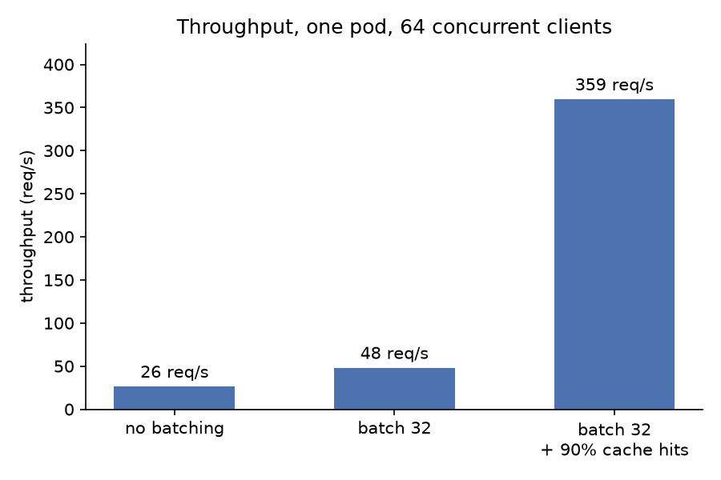
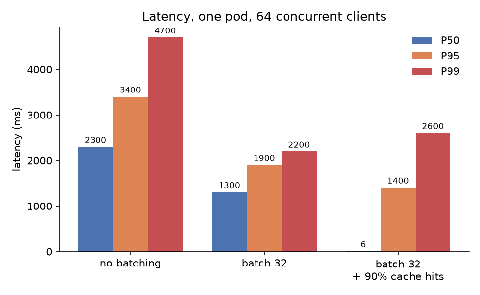
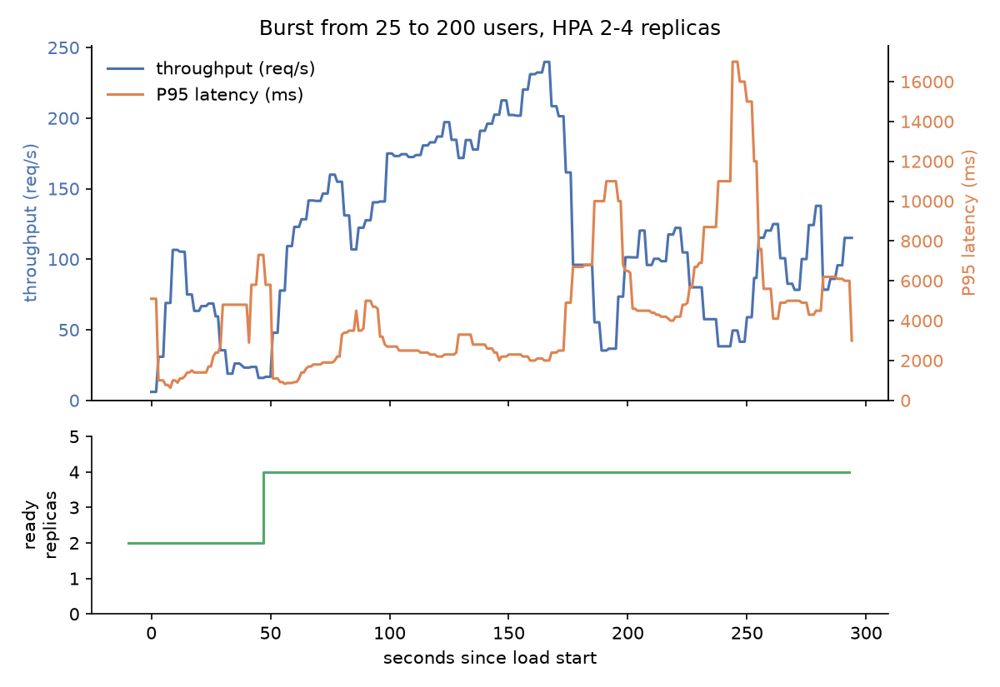

# ml-serve

A small Triton/BentoML-style model server built from scratch to explore production ML infrastructure. Serves a DistilBERT sentiment classifier on CPU.

## Setup

Requires [uv](https://docs.astral.sh/uv/) and Python 3.11.

```bash
uv sync
uv run uvicorn serve.app:app --host 127.0.0.1 --port 8765
```

```bash
curl localhost:8765/health
curl -X POST localhost:8765/predict \
  -H 'content-type: application/json' \
  -d '{"text":"this movie was great"}'
```

```json
{"label": "POSITIVE", "score": 0.9999, "latency_ms": 32.7, "cached": false}
```

### Docker

```bash
docker compose up --build
```

Runs four services: the server on 8000, Redis, Prometheus on 9090, and Grafana on 3000.

`make demo` does the same thing, then sends a minute of mixed hit/miss load so the Grafana dashboard has something on it, and prints the URLs. `make demo-down` stops it.

### Kubernetes

Requires [kind](https://kind.sigs.k8s.io/) and kubectl.

```bash
make cluster-up
```

Creates the cluster, installs metrics-server, builds and loads the images, and applies `k8s/`. The server ends up on port 30080 and Grafana on 30300.

```bash
make status        # pods and hpa
make bench-all     # the full scenario sweep below, ~40 min
make cluster-down
```

Two replicas by default, autoscaled to four when average CPU passes 60% of the requested 500m. Each pod pins torch to one thread so its CPU use means something to the autoscaler.

### Tests

```bash
uv run pytest
```

## How it works

Concurrent requests are grouped into one forward pass, flushed when `MAX_BATCH_SIZE` requests are queued or `MAX_WAIT_MS` elapses, whichever comes first.

Predictions are cached in Redis, keyed by a hash of the input text. A hit skips the model entirely. If Redis is down the server logs a warning and serves every request from the model.

## Configuration

| Variable | Default | What it does |
| --- | --- | --- |
| `MAX_BATCH_SIZE` | `32` | Requests per forward pass |
| `MAX_WAIT_MS` | `10` | How long the batcher waits before flushing a partial batch |
| `REDIS_URL` | `redis://localhost:6379/0` | Cache location |
| `CACHE_TTL_S` | `3600` | Prediction TTL |
| `MODEL_PATH` | HF checkpoint | Local model directory to load instead |
| `TORCH_THREADS` | unset | Threads for the forward pass. Unset lets torch size its own pool |

## Benchmarks

All scenarios run on the kind cluster under one Locust client, so the rows are comparable. Method, repeat runs and limitations in `benchmarks/phase5_load.md`.

| Scenario | Batch | Replicas | Hit rate | Throughput | P50 | P95 | P99 |
| --- | --- | --- | --- | --- | --- | --- | --- |
| No batching | 1 | 1 | 0% | 26.2 req/s | 2300 ms | 3400 ms | 4700 ms |
| Batching | 32 | 1 | 0% | 47.9 req/s | 1300 ms | 1900 ms | 2200 ms |
| Batching + cache | 32 | 1 | 90% | 359.5 req/s | 6 ms | 1400 ms | 2600 ms |
| Autoscaled, 64 users | 32 | 2→4 | 50% | 54.7 req/s | 920 ms | 3800 ms | 7200 ms |
| Autoscaled, 25→200 users | 32 | 2→4 | 50% | 114.2 req/s | 280 ms | 4800 ms | 9600 ms |





Batching is 1.83x on throughput, the median of three runs (1.80x, 2.35x, 1.83x). It wins less here than it does natively because each pod runs one torch thread under a 1-CPU limit, so there's no intra-op parallelism to exploit.

The cache row has a P50 of 6 ms and a P99 of 2600 ms in the same run. Hits skip the model and misses queue behind a forward pass, so the 177 ms mean for that run falls in a gap where almost no request actually landed.



The autoscaler adds pods in about a minute, 33 s to raise the target and another 32 s for the new pods to load the model and pass their probes. Whether that helps depends on the client. Four replicas behind a fixed pool of 64 connections managed 54.7 req/s, barely ahead of a single uncached replica, because kube-proxy balances connections rather than requests and the pods that arrive at t=65 s inherit none. The ramping client opens connections during the scale-out and peaked at 240 req/s, then fell to 35 req/s at flat load for reasons I haven't pinned down.

I checked these numbers against Agrawal et al., *On Evaluating Performance of LLM Inference Systems* ([arXiv:2507.09019](https://arxiv.org/abs/2507.09019)): [Auditing my own inference-server benchmarks](https://gist.github.com/russjm/ce38dde600b1aae380a2c9949bfd8093).

## Observability

The server exposes Prometheus metrics at `/metrics`: request count and end-to-end latency (both split by cache hit or miss), batch size, batcher queue depth, inference time, and Redis errors.

Prometheus scrapes every 5 seconds. Grafana loads its datasource and dashboard from `observability/grafana/`, so the dashboard is checked in rather than set up by hand.

## Model

Uses the pretrained `distilbert-base-uncased-finetuned-sst-2-english` checkpoint from HF. To use fine-tuned weights:

1. Run `train/train_distilbert.ipynb` on Colab
2. Download the model directory to `./model_local/`
3. Start the server with `MODEL_PATH=./model_local`

## License

MIT
